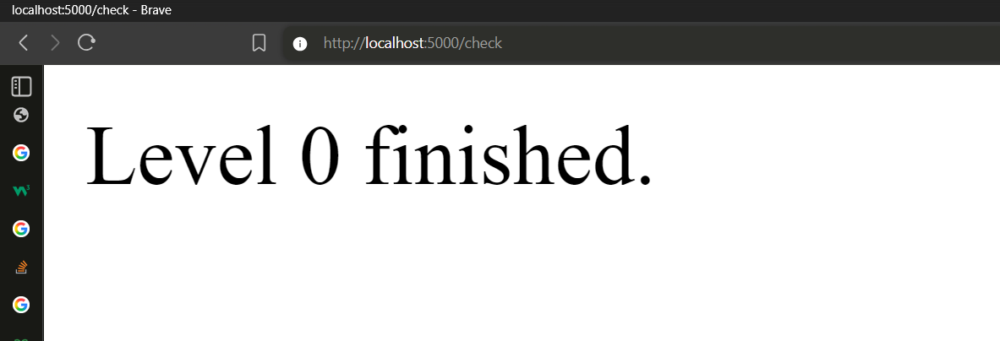

# Level 0
Introduction to flask , and python , this is a very simple application.

## Task
- Run this , simple program , by forking it and cloning your fork
```bash
git clone http://github.com/your_username/python_by_doing_0.git
cd python_by_doing_0
pip install -r requirements.txt
python src/app.py
```
- open this url in your browser "http://localhost:5000/"
- Then add a new route
> add this 3 lines after line 9
```python
@app.route('/check')
def task():
	return level_0()
```
- save the code
- then go to "http://localhost:5000/check"
- and if you see like this , then the level is finished.


- Now stop the program using `CTRL+C` 
- Run the following
```bash
git add -A
git stash
```
- Now mark your attendance below like the example
- Now push you changes to your fork 
```bash
git add -A
git commit -m "Level Completed"
git push origin main
```
- Now go to , http://github.com/aruncs31s/python_by_doing_0
- and open a new pull request.

## Attendance 

| Username | Date |
|------|----|
| Arun CS | 04-09-2025| 


## Flask
Flask is a micro web framework for Python. You can create web applications with it , and its easy as python.

This is the bare minimum code need to run a website.
```python
from flask import Flask
app = Flask(__name__)

@app.route('/')
def hello_world():
	return 'Hello, World!'
    
if __name__ == '__main__':
	app.run(debug=True)
```


- `from flask import Flask`: Imports the Flask class from the Flask library. You need to install it before using it. In this case we are installing it when we run `pip install -r requirements.txt`.
- `app = Flask(__name__)`: Creates a new Flask web application instance. 
- `@app.route('/')`: Defines a route for the root URL (/). When someone visits this URL, the function below is called. In this case this route is `http://localhost:5000/`.
- `def hello_world(): return 'Hello, World!'`: This function returns the string "Hello, World!" as the response for the root URL.
- `if __name__ == '__main__': app.run(debug=True)`: Runs the app in debug mode if the script is executed directly. ie, execute like this 
```bash
python src/app.py
```

Now if you want to add new route like `http://localhost:5000/bye`, you can do it like this:
```python
@app.route('/bye')
def goodbye():
	return 'bye'
```
You usually see like `/login` , `/logout` , `/signup` routes in web applications , whose routes are usually defined like this